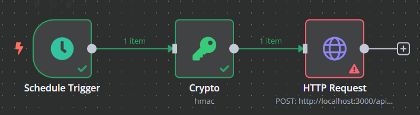

## Getting Started

First, run the development server:

```bash
npm run dev
```

## Features
- Error and performance tracking (Glitchtip)
- Analytics (Umami)
- Payment (Lemonsqueezy)
- Authentication (Auth.js)
- Database (Prisma x Mysql)
- Cron functionality for recurring tasks

### Next Features
- Mobile Navigation for homepage
- Onboarding
- File storage (Hetzner S3)

## WebApp development flow

1. Clone or fork this repo.
2. Mind error and performance tracking with sentry or another tool in the privacy policy.
3. Remove demo pages.
4. Change logos
3. Add your pages and features.

### Deploy on Cloudron

1. Add secrets and variables for github actions.
    - Variables
      - DOCKER_HUB_USERNAME
      - CLOUDRON_APP_DOMAIN
      - CLOUDRON_APP_DOMAIN_STAGING
      - UMAMI_WEBSITE_ID
      - UMAMI_WEBSITE_ID_STAGING
      - CLOUDRON_SERVER
    - Secrets
      - DOCKER_HUB_PERSONAL_ACCESS_TOKEN
      - CLOUDRON_API_TOKEN
2. Commit to deploy to the staging environment, create a release to deploy to production environment.
3. Update the env file.

### Add cron job
1. Add job to file `config/cron.config.ts`.
2. Create Workflow e.g. in n8n to trigger the job by calling the route `/api/webhooks/cron`. Mind the following form (no legal code syntax): 
```
{
   headers: {
      X-Signature: Hmac signature of the body and the key from env file (WEBHOOK_SECRET_CRON)
   },
   body (json body of the following form) : {
      "job": "job name"
   }
}
```
